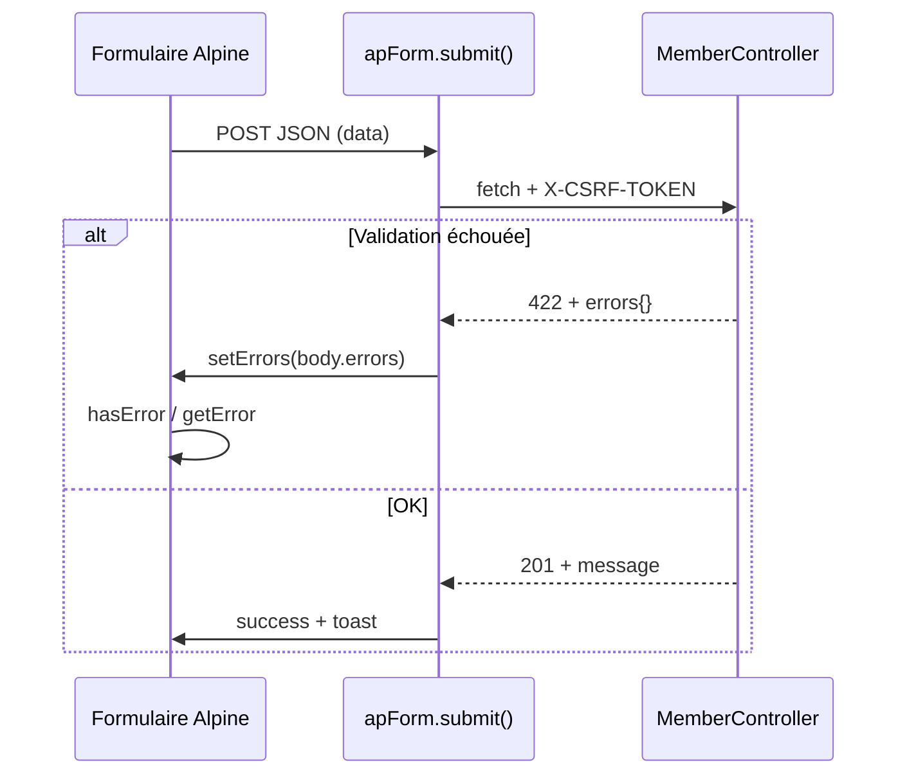

# Laravel — validation backend et apForm

Guide d’intégration avec **Laravel** et réponses **422** au format standard.

## Exemple complet

Tous les fichiers sont dans **[examples/laravel/](../examples/laravel/)** :

- `StoreMemberRequest` / `StoreTeamRequest` — règles et messages FR
- `MemberController` — JSON 201 / 422
- `members/create.blade.php` — formulaire avec `apSelect`, `apInputMask`, `apSwitch`
- `members/team.blade.php` — erreurs `members.N.champ`
- [samples/validation-422.json](../examples/laravel/samples/validation-422.json) — réponse de référence

## Flux de validation



## Format 422 (obligatoire)

Laravel renvoie nativement :

```json
{
  "message": "Les données fournies sont invalides.",
  "errors": {
    "email": ["L'adresse e-mail est déjà utilisée."],
    "members.0.name": ["Le nom du membre est obligatoire."]
  }
}
```

`apForm` (dans `Form.js`) détecte `res.status === 422 && body.errors` et appelle `setErrors(body.errors)`.

Chaque valeur peut être une **chaîne** ou un **tableau** — `setErrors` normalise en tableau.

## Soumission depuis Blade

```blade
<div x-data="{
    ...apForm({ data: { name: '', email: '' } }),
    async save() {
        const r = await this.submit('{{ route('members.store') }}', { method: 'POST' });
        if (r.ok) $store.toast.success(r.data.message);
        if (r.status === 422) $store.toast.error('Corrigez le formulaire.');
    },
}">
    <form @submit.prevent="save()">
        <input x-model="data.name" :class="hasError('name') && 'border-red-500'">
        <p x-show="hasError('name')" x-text="getError('name')"></p>
    </form>
</div>
```

## Erreurs SSR (redirect back)

Si vous utilisez une validation classique avec `redirect()->back()->withErrors()` :

```blade
errors: @json($errors->getMessages()),
```

`$errors->getMessages()` produit déjà `{ "email": ["…"] }` — compatible `apForm`.

## Form Request

```php
// StoreMemberRequest.php — extrait
public function rules(): array
{
    return [
        'name'  => ['required', 'string', 'min:2'],
        'email' => ['required', 'email'],
        'role'  => ['required', Rule::in(['dev', 'design', 'pm', 'devops'])],
    ];
}
```

Laravel valide automatiquement avant `store()` ; en cas d’échec sur requête **JSON/AJAX**, la réponse est **422** sans code supplémentaire.

## Nested : `members.*`

Règles :

```php
'members.*.name' => ['required', 'string'],
```

Erreurs côté Alpine :

```html
<p x-show="hasError('members.'+i+'.name')" x-text="getError('members.'+i+'.name')"></p>
```

## CSRF

Dans le layout :

```html
<meta name="csrf-token" content="{{ csrf_token() }}">
```

`apForm.submit()` lit ce meta et envoie `X-CSRF-TOKEN`.

## Livewire (alternative)

Pour une validation 100 % serveur sans `fetch`, voir [livewire.md](./livewire.md) et `wire:model.live` sur chaque composant.

`apForm` reste utile pour les formulaires **hybrides** (API + Alpine) ou les pages sans Livewire.

## Voir aussi

- [installation.md](./installation.md)
- [composants.md](./composants.md#apform)
- [examples/laravel/README.md](../examples/laravel/README.md)
